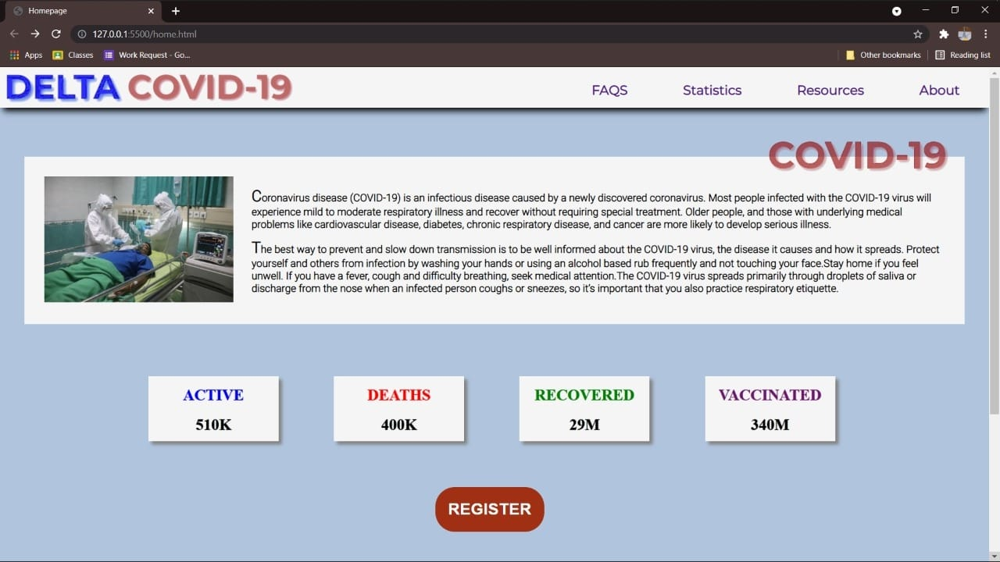
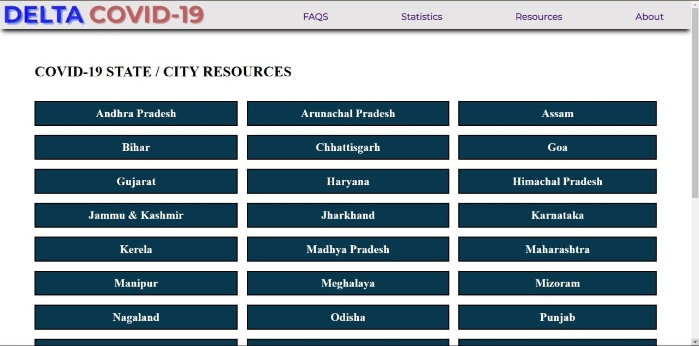

# Delta Covid-19 Project for GCCatSRM's Internal Hackathon
The idea behind this application is to display statistics of the impact of COVID-19 in and list the down the resources location and region wise that are available for the benefit of the public, in India.

## Technical Overview
This is a full-stack application which runs react.js in front-end and node.js in the back-end.

